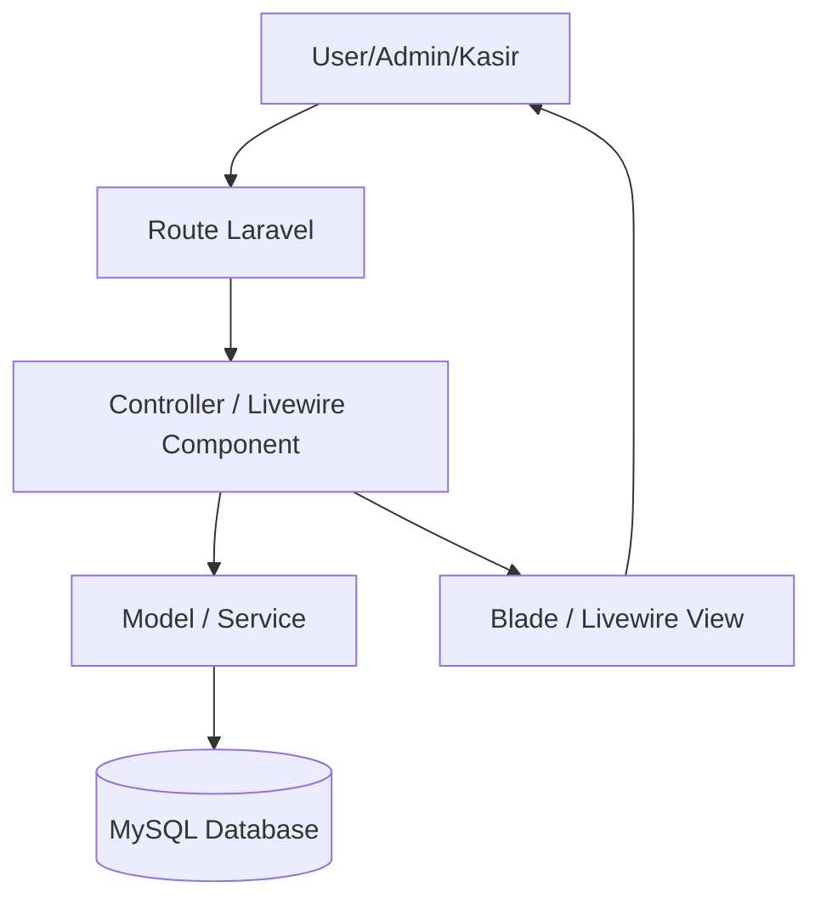
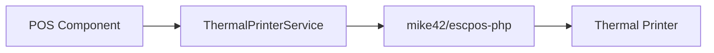
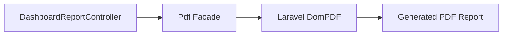
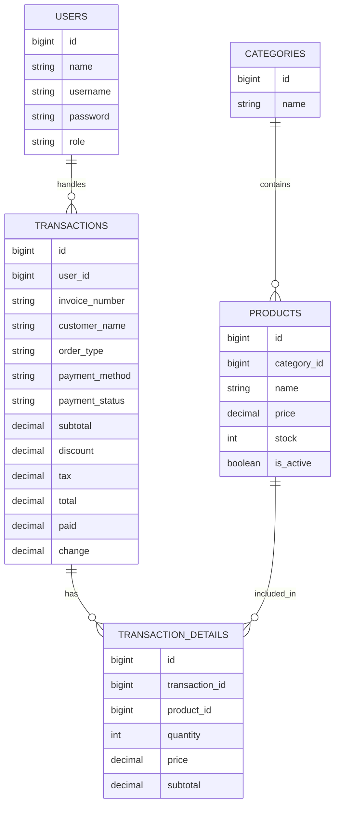

# POS Nasi Lawar Ulucatu

POS Nasi Lawar Ulucatu adalah aplikasi **Point of Sale (POS) berbasis web** yang dikembangkan untuk membantu proses operasional kasir dan admin pada usaha Nasi Lawar Ulucatu. Sistem ini mendukung pengelolaan master data, transaksi penjualan, pembayaran, pengelolaan stok, pencetakan struk pelanggan, kitchen order ticket, dashboard, dan laporan penjualan.

Project ini dibuat sebagai **Minimum Viable Product (MVP)** untuk Ujian Akhir Semester (UAS) mata kuliah **Rekayasa Perangkat Lunak Tahun Akademik 2025/2026**.

---

## Daftar Isi

- [1. Deskripsi Project](#1-deskripsi-project)
- [2. Informasi Project](#2-informasi-project)
- [3. Anggota Kelompok dan Kontribusi](#3-anggota-kelompok-dan-kontribusi)
- [4. Ruang Lingkup Sistem](#4-ruang-lingkup-sistem)
- [5. Fitur MVP](#5-fitur-mvp)
- [6. Tech Stack](#6-tech-stack)
- [7. Arsitektur Sistem MVC Laravel](#7-arsitektur-sistem-mvc-laravel)
- [8. Design Patterns yang Digunakan](#8-design-patterns-yang-digunakan)
- [9. Struktur Folder Project](#9-struktur-folder-project)
- [10. Database dan ERD](#10-database-dan-erd)
- [11. Cara Menjalankan Project Secara Lokal](#11-cara-menjalankan-project-secara-lokal)
- [12. Testing, Linter, dan Formatting](#12-testing-linter-dan-formatting)
- [13. GitFlow dan Conventional Commits](#13-gitflow-dan-conventional-commits)
- [14. Dokumentasi Video Individu](#14-dokumentasi-video-individu)
- [15. Dokumentasi Tambahan](#15-dokumentasi-tambahan)
- [16. Status MVP](#16-status-mvp)
- [17. Checklist Pengumpulan UAS](#17-checklist-pengumpulan-uas)
- [18. Referensi Design Pattern](#18-referensi-design-pattern)
- [19. Lisensi](#19-lisensi)

---

## 1. Deskripsi Project

POS Nasi Lawar Ulucatu adalah aplikasi Point of Sale berbasis web yang digunakan untuk membantu proses transaksi pada usaha makanan. Aplikasi ini dibuat agar proses kasir, pencatatan transaksi, pengelolaan stok, dan pembuatan laporan dapat dilakukan secara lebih rapi dan terpusat.

Sistem ini memiliki dua aktor utama, yaitu **Admin/Owner** dan **Kasir**. Admin/Owner dapat mengelola kategori, produk/menu, stok, transaksi, dashboard, dan laporan. Kasir dapat membuat transaksi, memilih menu, menginput nama customer, memilih metode pembayaran, serta mencetak struk pelanggan dan kitchen order ticket.

Fokus utama pengembangan project ini bukan hanya membuat aplikasi yang berjalan, tetapi juga menerapkan prinsip **Rekayasa Perangkat Lunak**, seperti penggunaan arsitektur yang jelas, design pattern, clean code, GitFlow, Pull Request, conventional commits, dan dokumentasi kontribusi anggota.

---

## 2. Informasi Project

| Keterangan          | Detail                             |
| ------------------- | ---------------------------------- |
| Nama Project        | POS Nasi Lawar Ulucatu             |
| Jenis Aplikasi      | Web-based Point of Sale            |
| Framework Utama     | Laravel                            |
| Frontend            | Blade, Livewire, Tailwind CSS      |
| Database            | MySQL                              |
| Arsitektur          | MVC Laravel                        |
| Design Pattern GoF  | Adapter Pattern dan Facade Pattern |
| Metode Pengembangan | Waterfall                          |
| Target Pengguna     | Admin/Owner dan Kasir              |
| Status              | MVP selesai                        |

---

## 3. Anggota Kelompok dan Kontribusi

> Link video individu dapat dilengkapi setelah masing-masing anggota mengunggah video ke YouTube Unlisted atau Google Drive.

| No  | Nama                       | NIM      | Peran                                                      | Issue/Fitur yang Dikerjakan                                                                                                                                     | Link Video Individu |
| --- | -------------------------- | -------- | ---------------------------------------------------------- | --------------------------------------------------------------------------------------------------------------------------------------------------------------- | ------------------- |
| 1   | Kadek Wahyu Santika Putra  | 42430012 | Fullstack Developer / Admin, Payment & Printer Integration | Issue #6 Modul Manajemen Master Data Admin, Issue #8 Integrasi Pembayaran QRIS Dinamis, Issue #9 Integrasi Printer Thermal, bugfix tambahan pada flow transaksi | Isi link video      |
| 2   | I Nyoman Theo Ardiles Rada | 42430018 | Fullstack Developer / POS Flow, Report & UI Fixing         | POS kasir, cart management, reset stok, export laporan PDF, perbaikan tampilan dan navigasi                                                                     | Isi link video      |

---

Link video penjelasan demo aplikasi kelompok:

| No  | Nama           | Link Video     |
| --- | -------------- | -------------- |
| 1   | Santika & Rada | Isi link video |

---

## 4. Ruang Lingkup Sistem

Sistem digunakan oleh dua aktor utama, yaitu **Admin/Owner** dan **Kasir**.

### 4.1 Admin/Owner

Admin/Owner dapat:

- Login ke sistem.
- Mengelola data kategori.
- Mengelola data produk/menu.
- Mengatur status aktif produk.
- Mengatur stok porsi harian.
- Melihat dashboard laporan penjualan.
- Melihat riwayat transaksi.
- Mengekspor laporan dalam format PDF.

### 4.2 Kasir

Kasir dapat:

- Login ke sistem.
- Membuat transaksi baru.
- Memilih produk/menu.
- Mengelola keranjang transaksi.
- Menginput nama customer.
- Memilih tipe pesanan dine-in atau take-away.
- Memilih metode pembayaran cash, transfer, atau QRIS.
- Mengelola status pembayaran QRIS.
- Mencetak struk pelanggan.
- Mencetak kitchen order ticket untuk dapur.

---

## 5. Fitur MVP

| Kode | Fitur                                     | Status  |
| ---- | ----------------------------------------- | ------- |
| F-01 | Login admin dan kasir                     | Selesai |
| F-02 | Dashboard admin                           | Selesai |
| F-03 | Manajemen kategori                        | Selesai |
| F-04 | Manajemen produk/menu                     | Selesai |
| F-05 | Status aktif/nonaktif produk              | Selesai |
| F-06 | Pengelolaan stok produk                   | Selesai |
| F-07 | Reset stok produk                         | Selesai |
| F-08 | Transaksi POS kasir                       | Selesai |
| F-09 | Cart management                           | Selesai |
| F-10 | Input nama customer                       | Selesai |
| F-11 | Pembayaran cash                           | Selesai |
| F-12 | Pembayaran transfer                       | Selesai |
| F-13 | Pembayaran QRIS manual/dinamis            | Selesai |
| F-14 | Status pembayaran pending dan success     | Selesai |
| F-15 | Pengurangan stok setelah transaksi sukses | Selesai |
| F-16 | Cetak struk pelanggan                     | Selesai |
| F-17 | Cetak kitchen order ticket                | Selesai |
| F-18 | Riwayat transaksi                         | Selesai |
| F-19 | Filter transaksi                          | Selesai |
| F-20 | Export laporan PDF                        | Selesai |

---

## 6. Tech Stack

| Kategori        | Teknologi                     |
| --------------- | ----------------------------- |
| Backend         | PHP 8.2+, Laravel             |
| Frontend        | Blade, Livewire, Tailwind CSS |
| Build Tool      | Vite                          |
| Database        | MySQL                         |
| ORM             | Eloquent ORM                  |
| PDF Generator   | `barryvdh/laravel-dompdf`     |
| Thermal Printer | `mike42/escpos-php`           |
| Testing         | Pest / Laravel Test           |
| Formatter       | Laravel Pint                  |
| Package Manager | Composer, npm                 |
| Version Control | Git dan GitHub                |

---

## 7. Arsitektur Sistem MVC Laravel

Project ini menggunakan arsitektur **MVC (Model-View-Controller)** yang merupakan pola arsitektur utama pada framework Laravel. MVC digunakan agar kode aplikasi lebih terstruktur dengan memisahkan bagian data, tampilan, dan alur kontrol aplikasi.

Referensi konsep MVC pada project ini mengikuti contoh pola MVC pada repository pembelajaran design pattern dari Humadev, di mana aplikasi dipisahkan menjadi bagian **Model**, **View**, dan **Controller**.

### 7.1 Model

Model bertanggung jawab untuk merepresentasikan data dan relasi database. Pada project ini, model digunakan untuk membaca, menyimpan, mengubah, dan menghapus data aplikasi.

**Lokasi File:**

- `app/Models/User.php`
- `app/Models/Category.php`
- `app/Models/Product.php`
- `app/Models/Transaction.php`
- `app/Models/TransactionDetail.php`

**Contoh tanggung jawab Model:**

- `User` menyimpan data akun admin dan kasir.
- `Category` menyimpan data kategori produk/menu.
- `Product` menyimpan data menu, harga, stok, kategori, dan status aktif.
- `Transaction` menyimpan data utama transaksi.
- `TransactionDetail` menyimpan daftar item pada transaksi.

### 7.2 View

View bertanggung jawab untuk menampilkan antarmuka pengguna. Pada project ini, View dibuat menggunakan Blade dan Livewire view untuk menampilkan halaman admin, halaman kasir, dashboard, form input, tabel data, halaman transaksi, dan laporan.

**Lokasi File:**

- `resources/views`
- `resources/views/livewire`
- `resources/views/components`

**Contoh tanggung jawab View:**

- Menampilkan halaman login.
- Menampilkan dashboard admin.
- Menampilkan tabel kategori dan produk.
- Menampilkan halaman POS kasir.
- Menampilkan modal pembayaran.
- Menampilkan halaman laporan dan transaksi.

### 7.3 Controller / Livewire Component

Controller bertanggung jawab untuk mengatur alur request dan menghubungkan Model dengan View. Pada project ini, selain controller Laravel, beberapa interaksi dinamis juga ditangani oleh Livewire Component.

**Lokasi File:**

- `app/Http/Controllers`
- `app/Livewire`
- `routes/web.php`

**Contoh tanggung jawab Controller / Livewire Component:**

- Mengatur route halaman admin dan kasir.
- Mengelola input dari user.
- Memanggil model atau service yang dibutuhkan.
- Mengarahkan data ke view.
- Mengelola alur transaksi POS.
- Mengatur export laporan PDF.

### 7.4 Alur MVC pada Project



### 7.5 Manfaat MVC pada Project

Dengan menggunakan MVC, project ini memiliki beberapa manfaat:

- Kode lebih terstruktur.
- Bagian data, tampilan, dan kontrol tidak dicampur dalam satu file.
- Pengembangan fitur lebih mudah dibagi antar anggota kelompok.
- Perubahan tampilan tidak selalu memengaruhi logic database.
- Logic aplikasi lebih mudah dibaca dan dirawat.

---

## 8. Design Patterns yang Digunakan

Selain menggunakan MVC sebagai arsitektur utama, project ini juga menerapkan dua design pattern dari rumpun **Gang of Four (GoF)**, yaitu **Adapter Pattern** dan **Facade Pattern**.

Design pattern ini digunakan untuk memenuhi kebutuhan rekayasa perangkat lunak agar kode lebih modular, mudah dirawat, dan tidak terlalu bergantung langsung pada detail teknis library eksternal.

---

### 8.1 Adapter Pattern

| Item             | Penjelasan                                                       |
| ---------------- | ---------------------------------------------------------------- |
| Nama Pattern     | Adapter Pattern                                                  |
| Kategori GoF     | Structural Pattern                                               |
| Lokasi File      | `app/Services/ThermalPrinterService.php`                         |
| Fitur Terkait    | Integrasi Printer Thermal, Struk Pelanggan, Kitchen Order Ticket |
| Referensi Konsep | `humadev/design_pattern/gof/06_adapter.ts`                       |

#### Penjelasan Konsep

Berdasarkan konsep GoF, **Adapter Pattern** adalah design pattern yang digunakan untuk menghubungkan sistem utama dengan class, library, atau interface lain yang berbeda. Adapter bertindak sebagai pembungkus atau penerjemah agar kode utama tetap dapat menggunakan fitur eksternal tanpa harus mengetahui detail implementasi internalnya.

#### Penerapan pada Project

Pada project POS Nasi Lawar Ulucatu, Adapter Pattern diterapkan pada file:

```txt
app/Services/ThermalPrinterService.php
```

Pattern ini digunakan karena aplikasi perlu berkomunikasi dengan library printer thermal `mike42/escpos-php`. Library printer memiliki detail teknis seperti:

- Connector printer.
- Profile printer.
- Format teks.
- Alignment.
- Feed.
- Cut.
- Command print.

Jika seluruh detail tersebut dipanggil langsung dari komponen POS atau halaman kasir, maka kode utama aplikasi akan terlalu bergantung pada library printer. Hal ini membuat kode lebih sulit dirawat dan lebih sulit diubah jika printer atau library diganti.

Karena itu, `ThermalPrinterService.php` digunakan sebagai adapter. Komponen POS cukup memanggil service untuk mencetak struk pelanggan atau kitchen order ticket. Detail teknis printer ditangani di dalam service tersebut.

#### Manfaat Adapter Pattern

- Kode printer lebih terpusat.
- Komponen POS tidak perlu mengetahui detail teknis printer.
- Logic transaksi tidak bercampur dengan command printer.
- Jika printer atau library printer diganti, perubahan cukup dilakukan pada service printer.
- Kode lebih modular dan mudah dirawat.

#### Contoh Alur Adapter



---

### 8.2 Facade Pattern

| Item                  | Penjelasan                                                 |
| --------------------- | ---------------------------------------------------------- |
| Nama Pattern          | Facade Pattern                                             |
| Kategori GoF          | Structural Pattern                                         |
| Lokasi File           | `app/Http/Controllers/Admin/DashboardReportController.php` |
| Library Terkait       | `barryvdh/laravel-dompdf`                                  |
| Facade yang Digunakan | `Pdf`                                                      |
| Fitur Terkait         | Export Laporan PDF                                         |
| Referensi Konsep      | `humadev/design_pattern/gof/10_facade.ts`                  |

#### Penjelasan Konsep

Berdasarkan konsep GoF, **Facade Pattern** adalah design pattern yang digunakan untuk menyediakan interface sederhana terhadap proses atau subsystem yang kompleks. Facade menyembunyikan detail teknis internal dan menyediakan cara pemanggilan yang lebih ringkas bagi client.

#### Penerapan pada Project

Pada project POS Nasi Lawar Ulucatu, Facade Pattern diterapkan pada fitur export laporan PDF. Proses pembuatan laporan PDF membutuhkan beberapa tahapan, seperti:

- Mengambil data transaksi.
- Menghitung total omzet.
- Menghitung jumlah transaksi.
- Mengambil data menu terlaris.
- Mengambil informasi stok.
- Merender view laporan.
- Mengatur ukuran kertas.
- Menghasilkan file PDF.
- Mengunduh file PDF.

Agar proses tersebut tidak terlalu kompleks di banyak bagian aplikasi, project menggunakan facade `Pdf` dari Laravel DomPDF. Dengan facade ini, controller cukup memanggil interface sederhana untuk memuat view, mengatur format kertas, dan mengunduh laporan PDF.

#### Manfaat Facade Pattern

- Proses export PDF menjadi lebih sederhana.
- Detail teknis PDF generator tidak tersebar di banyak file.
- Controller lebih mudah dibaca.
- Fitur laporan lebih mudah dirawat.
- Pemanggilan PDF dapat dilakukan dengan interface yang ringkas.

#### Contoh Alur Facade



---

### 8.3 Catatan Tambahan: Service Layer

Project ini juga menggunakan pendekatan **Service Layer** pada beberapa proses bisnis, seperti pembayaran, transaksi, dan integrasi printer. Namun, Service Layer tidak dihitung sebagai GoF Design Pattern utama.

Service Layer digunakan sebagai pendukung arsitektur agar logic bisnis tidak menumpuk di View atau Controller.

**Contoh lokasi file:**

- `app/Services/TransactionPaymentService.php`
- `app/Services/ThermalPrinterService.php`

**Manfaat Service Layer:**

- Logic bisnis lebih terpusat.
- Komponen UI lebih bersih.
- Kode lebih mudah dirawat.
- Fitur lebih mudah diuji dan dikembangkan.

---

## 9. Struktur Folder Project

```txt
app/
├── Http/
│   ├── Controllers/          # Controller Laravel
│   └── Middleware/           # Middleware role dan autentikasi
├── Livewire/                 # Komponen Livewire untuk UI dinamis
├── Models/                   # Model Eloquent
├── Providers/                # Service Provider Laravel
└── Services/                 # Business logic dan integrasi eksternal

config/                       # Konfigurasi aplikasi dan package
database/
├── factories/                # Factory data dummy
├── migrations/               # Struktur tabel database
└── seeders/                  # Seeder data awal

public/                       # Asset publik
resources/
├── css/                      # CSS entrypoint
├── js/                       # JavaScript entrypoint
└── views/                    # Blade dan Livewire views

routes/
├── web.php                   # Route web aplikasi
└── console.php               # Route command console

tests/
├── Feature/                  # Feature test
└── Unit/                     # Unit test
```

---

## 10. Database dan ERD

### 10.1 Entitas Utama

| Entitas               | Deskripsi                                                                       |
| --------------------- | ------------------------------------------------------------------------------- |
| `users`               | Menyimpan data akun admin dan kasir                                             |
| `categories`          | Menyimpan kategori produk/menu                                                  |
| `products`            | Menyimpan data produk, harga, stok, status aktif, dan gambar                    |
| `transactions`        | Menyimpan header transaksi, invoice, customer, pembayaran, dan status transaksi |
| `transaction_details` | Menyimpan detail produk yang dibeli dalam transaksi                             |

### 10.2 Relasi Utama

| Relasi                          | Keterangan                                          |
| ------------------------------- | --------------------------------------------------- |
| User - Transaction              | Satu user/kasir dapat menangani banyak transaksi    |
| Category - Product              | Satu kategori memiliki banyak produk                |
| Transaction - TransactionDetail | Satu transaksi memiliki banyak detail transaksi     |
| Product - TransactionDetail     | Satu produk dapat muncul di banyak detail transaksi |

### 10.3 ERD Sederhana



---

## 11. Cara Menjalankan Project Secara Lokal

### 11.1 Prasyarat

Pastikan perangkat sudah memiliki tools berikut:

| Tools    | Versi Minimum   |
| -------- | --------------- |
| PHP      | 8.2+            |
| Composer | 2.x             |
| Node.js  | 20.x disarankan |
| npm      | 10.x disarankan |
| MySQL    | 8.x disarankan  |

### 11.2 Clone Repository

```bash
git clone https://github.com/wsantika/pos-nasiLawarUlucatu.git
cd pos-nasiLawarUlucatu
```

### 11.3 Install Dependency

```bash
composer install
npm install
```

### 11.4 Setup Environment

```bash
cp .env.example .env
php artisan key:generate
```

Sesuaikan konfigurasi database pada file `.env`.

```env
DB_CONNECTION=mysql
DB_HOST=127.0.0.1
DB_PORT=3306
DB_DATABASE=pos_nasilawarulucatu
DB_USERNAME=root
DB_PASSWORD=
```

### 11.5 Setup Konfigurasi Printer Thermal

Konfigurasi printer thermal dapat diatur pada file `.env`.

```env
THERMAL_PRINTER_ENABLED=true
THERMAL_PRINTER_NAME=POS-58
THERMAL_PRINTER_LINE_WIDTH=32
THERMAL_PRINTER_CUT=false
```

Jika printer tidak digunakan saat development, ubah menjadi:

```env
THERMAL_PRINTER_ENABLED=false
```

### 11.6 Migrasi Database

```bash
php artisan migrate
```

Seeder dapat dijalankan untuk kebutuhan development.

```bash
php artisan db:seed
```

> Catatan: Jangan gunakan credential default dari seeder untuk production tanpa mengganti password.

### 11.7 Jalankan Aplikasi Development

```bash
composer run dev
```

Atau jalankan backend dan frontend secara manual.

```bash
php artisan serve
npm run dev
```

Akses aplikasi melalui browser:

```txt
http://127.0.0.1:8000
```

### 11.8 Jalankan di iPad atau Device Satu WiFi

Build asset terlebih dahulu.

```bash
npm run build
```

Jalankan Laravel agar dapat diakses dari device lain dalam jaringan yang sama.

```bash
php artisan serve --host=0.0.0.0 --port=8000
```

Buka dari iPad/tablet menggunakan IP laptop/server.

```txt
http://192.168.x.x:8000
```

### 11.9 Test Printer

```bash
php artisan printer:test
```

---

## 12. Testing, Linter, dan Formatting

### 12.1 Menjalankan Test

```bash
php artisan test
```

Atau melalui script Composer:

```bash
composer test
```

### 12.2 Formatting PHP

Project menggunakan **Laravel Pint** untuk menjaga style kode PHP.

```bash
./vendor/bin/pint
```

### 12.3 Build Asset

```bash
npm run build
```

### 12.4 Clear Cache

Jika terdapat perubahan view, config, atau route, jalankan:

```bash
php artisan optimize:clear
```

### 12.5 Bukti Verifikasi

```txt
php artisan test
Tests: passed
```

---

## 13. GitFlow dan Conventional Commits

Project ini menggunakan alur kerja **GitFlow** agar pengembangan lebih rapi dan mudah diaudit.

### 13.1 Branch

| Branch               | Fungsi                        |
| -------------------- | ----------------------------- |
| `main`               | Branch stabil/production      |
| `dev`                | Branch integrasi pengembangan |
| `feature/nama-fitur` | Branch pengerjaan fitur baru  |
| `fix/nama-bug`       | Branch perbaikan bug          |

### 13.2 Aturan Kontribusi

- Tidak melakukan commit langsung ke `main`.
- Fitur dan bugfix dikerjakan pada branch terpisah.
- Merge perubahan dilakukan melalui Pull Request.
- Pull Request direview minimal oleh satu anggota tim.
- Commit mengikuti format Conventional Commits.

### 13.3 Contoh Conventional Commits

```txt
feat(admin): add category management
feat(product): add product status is_active
feat(payment): add qris payment flow
feat(printer): add thermal printer receipt
feat(report): add PDF export functionality
fix(payment): fix shortcut payment amount
fix(transaction): fix receipt print flow
docs(readme): update architecture and design pattern documentation
```

---

## 14. Dokumentasi Video Individu

Setiap anggota kelompok membuat video penjelasan individu berdurasi 5-7 menit.

### 14.1 Konten Wajib Video

Video individu harus mencakup:

1. Andil dan kontribusi Git.
2. Branch `feature/` yang dikerjakan.
3. Pull Request yang dibuat atau direview.
4. Demo kode dari fitur/modul yang dikerjakan.
5. Penjelasan arsitektur MVC pada bagian kode.
6. Penjelasan design pattern yang diterapkan.
7. Pembuktian linter, formatter, testing, atau clean code.
8. Demo aplikasi secara singkat.

### 14.2 Fokus Video Santika

| Bagian         | Penjelasan                                        |
| -------------- | ------------------------------------------------- |
| Issue utama    | Issue #6, #8, #9                                  |
| Fitur          | Master data admin, QRIS, printer thermal          |
| Arsitektur     | MVC Laravel                                       |
| Design Pattern | Adapter Pattern pada `ThermalPrinterService.php`  |
| Clean Code     | Pemisahan logic printer dan pembayaran ke service |

### 14.3 Fokus Video Rada

| Bagian            | Penjelasan                                                    |
| ----------------- | ------------------------------------------------------------- |
| Issue/Fitur utama | POS kasir, cart management, reset stok, export PDF, UI fixing |
| Fitur             | POS flow, laporan, PDF export                                 |
| Arsitektur        | MVC Laravel                                                   |
| Design Pattern    | Facade Pattern pada export PDF                                |
| Clean Code        | Pemisahan tampilan, controller, model, dan service            |

---

## 15. Dokumentasi Tambahan

Folder `docs/` dapat digunakan untuk menyimpan dokumentasi pendukung apabila terdapat pembaruan dari rancangan UTS.

Dokumentasi yang disarankan:

- Use Case Diagram
- Activity Diagram
- ERD


---

## 16. Status MVP

| Kategori            | Status           | Keterangan                                                   |
| ------------------- | ---------------- | ------------------------------------------------------------ |
| Autentikasi         | Selesai          | Login dan role admin/kasir tersedia                          |
| Admin Panel         | Selesai          | Dashboard, kategori, produk, transaksi                       |
| Master Data         | Selesai          | Kategori dan produk dapat dikelola                           |
| Stok                | Selesai          | Stok produk dapat diatur dan dikurangi saat transaksi sukses |
| POS Kasir           | Selesai          | Keranjang, pembayaran, customer, struk                       |
| QRIS Manual/Dinamis | Selesai          | Pending, confirm, cancel                                     |
| Printer Thermal     | Selesai          | Customer receipt dan kitchen order ticket                    |
| Export PDF          | Selesai          | Laporan harian dan bulanan                                   |
| Testing             | Minimal          | Test bawaan Laravel berjalan                                 |
| Dokumentasi         | Perlu finalisasi | Link video individu dan docs perlu dilengkapi                |

---

## 17. Checklist Pengumpulan UAS

### 17.1 Produk Kelompok

- [x] Aplikasi dapat dijalankan secara lokal.
- [x] Fitur MVP utama tersedia.
- [x] Validasi input tersedia pada fitur penting.
- [x] Error handling dasar tersedia.
- [x] Struktur folder mengikuti Laravel.
- [x] Arsitektur MVC dijelaskan di README.
- [x] Minimal 2 GoF design pattern didokumentasikan.
- [x] Letak file design pattern dicantumkan.
- [x] README utama tersedia.
- [x] Data kontribusi anggota tersedia.
- [ ] Link video individu sudah lengkap.
- [x] Folder `docs/` sudah berisi diagram final jika ada pembaruan dari UTS.
- [ ] Screenshot atau bukti testing/linter sudah disiapkan.

### 17.2 Git dan Kolaborasi

- [x] Commit menggunakan Conventional Commits.
- [x] Branch `main` digunakan untuk versi stabil.
- [x] Branch `dev` digunakan untuk integrasi pengembangan.
- [x] Fitur dikerjakan pada branch `feature/nama-fitur`.
- [x] Pull Request digunakan saat merge fitur.
- [ ] Bukti PR/review sudah siap ditampilkan pada video individu.

---

## 18. Referensi Design Pattern

Referensi design pattern yang digunakan:

- Humadev Design Pattern Repository: `https://github.com/humadev/design_pattern`
- MVC Pattern: `https://github.com/humadev/design_pattern/tree/main/mvc`
- Adapter Pattern: `https://github.com/humadev/design_pattern/blob/main/gof/06_adapter.ts`
- Facade Pattern: `https://github.com/humadev/design_pattern/blob/main/gof/10_facade.ts`

---

## 19. Lisensi

Project ini dibuat untuk kebutuhan akademik UAS Rekayasa Perangkat Lunak Tahun Akademik 2025/2026. Dependency dan package yang digunakan mengikuti lisensi masing-masing library.
