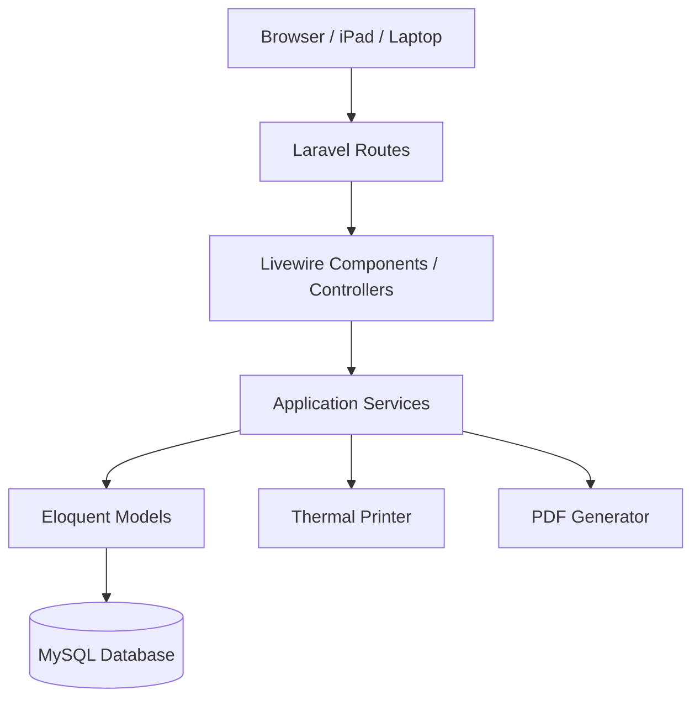
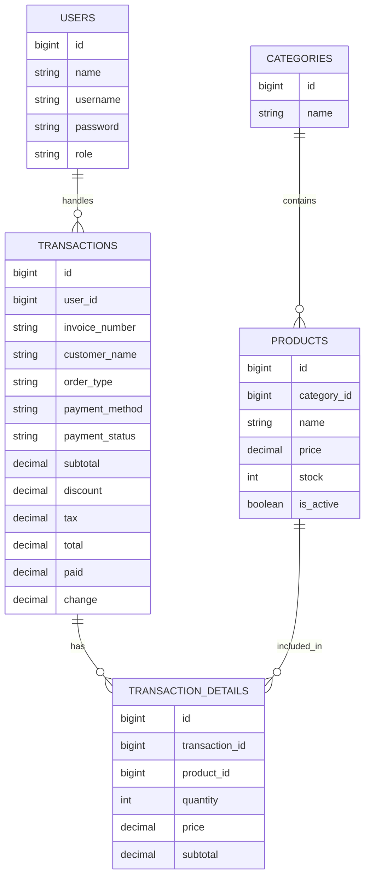

# POS Nasi Lawar Ulucatu

POS Nasi Lawar Ulucatu adalah aplikasi **Point of Sale (POS) berbasis web** yang dikembangkan untuk mendukung operasional kasir, pengelolaan produk, pengelolaan kategori, pencatatan transaksi, pembayaran, pencetakan struk thermal, kitchen ticket, dan laporan penjualan.

Project ini dibuat sebagai **Minimum Viable Product (MVP)** untuk Ujian Akhir Semester (UAS) mata kuliah **Rekayasa Perangkat Lunak Tahun Akademik 2025/2026**.

---

## 1. Informasi Project

| Keterangan          | Detail                  |
| ------------------- | ----------------------- |
| Nama Project        | POS Nasi Lawar Ulucatu  |
| Jenis Aplikasi      | Web-based Point of Sale |
| Framework Utama     | Laravel                 |
| Metode Pengembangan | Waterfall               |
| Arsitektur          | Layered Architecture    |
| Target Pengguna     | Admin/Owner dan Kasir   |
| Status              | MVP selesai             |

---

## 2. Kontribusi Anggota Kelompok

> Lengkapi bagian link video setelah video individu sudah diunggah ke YouTube Unlisted atau Google Drive.

| No  | Nama                       | NIM      |
| --- | -------------------------- | -------- |
| 1   | Kadek Wahyu Santika Putra  | 42430012 |
| 2   | I Nyoman Theo Ardiles Rada | 42430018 |

Link video penjelasan kelompok:

| No  | Nama           | Link Video     |
| --- | -------------- | -------------- |
| 1   | Santika & Rada | Isi link video |

---

## 3. Abstrak

POS Nasi Lawar Ulucatu adalah aplikasi Point of Sale berbasis web yang dirancang untuk membantu proses operasional kasir pada usaha Nasi Lawar Ulucatu. Sistem ini menyediakan fitur login berdasarkan role, pengelolaan kategori dan produk, pengelolaan stok harian, transaksi kasir, pembayaran melalui cash, transfer, dan QRIS manual, pencetakan struk pelanggan, pencetakan kitchen ticket, riwayat transaksi, dashboard rekap penjualan, serta export laporan PDF.

Aplikasi ini dikembangkan dengan Laravel, Livewire, Blade, Tailwind CSS, MySQL, dan integrasi thermal printer. Fokus utama pengembangan adalah menghasilkan MVP yang dapat berjalan secara lokal, memiliki struktur kode yang rapi, menerapkan Layered Architecture, dan mendokumentasikan design pattern yang digunakan.

**Kata kunci:** POS, Laravel, Livewire, Thermal Printer, Dashboard, Rekayasa Perangkat Lunak.

---

## 4. Ruang Lingkup Sistem

Sistem digunakan oleh dua aktor utama, yaitu **Admin/Owner** dan **Kasir**.

### 4.1 Admin/Owner

Admin/Owner dapat:

- Login ke sistem.
- Mengelola data kategori.
- Mengelola data produk/menu.
- Mengatur stok porsi harian.
- Melihat dashboard laporan penjualan.
- Melihat riwayat transaksi.
- Mengekspor laporan dalam format PDF.

### 4.2 Kasir

Kasir dapat:

- Login ke sistem.
- Membuat transaksi baru.
- Memilih produk/menu.
- Menginput nama customer.
- Memilih tipe pesanan dine-in atau take-away.
- Memilih metode pembayaran cash, transfer, atau QRIS.
- Mencetak struk pelanggan.
- Mencetak kitchen ticket untuk dapur.

---

## 5. Fitur MVP

| Kode | Fitur                                     | Status  |
| ---- | ----------------------------------------- | ------- |
| F-01 | Login admin dan kasir                     | Selesai |
| F-02 | Manajemen kategori                        | Selesai |
| F-03 | Manajemen produk dan stok                 | Selesai |
| F-04 | Reset stok produk                         | Selesai |
| F-05 | Transaksi POS kasir                       | Selesai |
| F-06 | Input nama customer                       | Selesai |
| F-07 | Pembayaran cash, transfer, dan QRIS       | Selesai |
| F-08 | Konfirmasi/cancel pembayaran QRIS pending | Selesai |
| F-09 | Cetak struk pembayaran                    | Selesai |
| F-10 | Cetak kitchen ticket                      | Selesai |
| F-11 | Riwayat dan filter transaksi              | Selesai |
| F-12 | Dashboard laporan harian dan bulanan      | Selesai |
| F-13 | Export PDF laporan dashboard              | Selesai |

---

## 6. Tech Stack

| Kategori        | Teknologi                     |
| --------------- | ----------------------------- |
| Backend         | PHP 8.2+, Laravel             |
| Frontend        | Blade, Livewire, Tailwind CSS |
| Build Tool      | Vite                          |
| Database        | MySQL                         |
| PDF Generator   | `barryvdh/laravel-dompdf`     |
| Thermal Printer | `mike42/escpos-php`           |
| Testing         | Pest / Laravel Test           |
| Formatter       | Laravel Pint                  |
| Package Manager | Composer, npm                 |

---

## 7. Arsitektur Sistem

### 7.1 Pola Arsitektur

Project ini menggunakan **Layered Architecture**. Arsitektur ini digunakan agar kode tidak menumpuk di satu file dan setiap bagian aplikasi memiliki tanggung jawab yang jelas.

| Layer                        | Tanggung Jawab                                                                                                  | Lokasi File                                         |
| ---------------------------- | --------------------------------------------------------------------------------------------------------------- | --------------------------------------------------- |
| Presentation Layer           | Menangani tampilan, route, event UI, validasi input, dan interaksi user                                         | `routes/web.php`, `app/Livewire`, `resources/views` |
| Application / Business Layer | Mengelola proses bisnis seperti pembayaran, validasi transaksi, pengurangan stok, pencetakan struk, dan laporan | `app/Services`, `app/Http/Controllers`              |
| Data Access Layer            | Mengakses dan memanipulasi data menggunakan model dan database                                                  | `app/Models`, `database/migrations`                 |
| Infrastructure Layer         | Menangani integrasi eksternal seperti printer thermal, PDF generator, storage, dan konfigurasi aplikasi         | `config`, service printer, package eksternal        |

### 7.2 Diagram Layer



### 7.3 Struktur Folder Utama

```txt
app/
├── Http/
│   ├── Controllers/      # Controller untuk laporan/export PDF
│   └── Middleware/       # Middleware role admin dan kasir
├── Livewire/             # Komponen halaman dan interaksi UI
├── Models/               # Eloquent model
├── Providers/            # Laravel service provider
└── Services/             # Business/application service

config/                   # Konfigurasi aplikasi dan printer
database/
├── migrations/           # Struktur tabel database
├── seeders/              # Data awal development
└── factories/            # Factory untuk testing/development

resources/
├── views/                # Blade dan Livewire views
├── css/                  # CSS entrypoint
└── js/                   # JavaScript entrypoint

routes/                   # Route aplikasi
tests/                    # Unit dan feature tests
```

---

## 8. Design Patterns yang Digunakan

Project ini menerapkan minimal dua design pattern dari rumpun **Gang of Four (GoF)**, yaitu **Adapter Pattern** dan **Facade Pattern**. Selain itu, project juga menggunakan **Service Layer** sebagai pattern arsitektural pendukung, tetapi Service Layer tidak dihitung sebagai GoF pattern utama.

### 8.1 Adapter Pattern

| Item                      | Penjelasan                                                                                                                                                                                                                                                                   |
| ------------------------- | ---------------------------------------------------------------------------------------------------------------------------------------------------------------------------------------------------------------------------------------------------------------------------- |
| Nama Pattern              | Adapter Pattern                                                                                                                                                                                                                                                              |
| Kategori GoF              | Structural Pattern                                                                                                                                                                                                                                                           |
| Lokasi File               | `app/Services/ThermalPrinterService.php`                                                                                                                                                                                                                                     |
| Masalah yang Diselesaikan | Library printer thermal `mike42/escpos-php` memiliki detail teknis seperti connector, profile printer, perintah print, feed, cut, dan formatting text. Jika detail ini dipanggil langsung dari komponen kasir, maka kode POS akan terlalu bergantung pada library eksternal. |
| Solusi                    | `ThermalPrinterService` berperan sebagai adapter yang membungkus library printer menjadi method yang lebih sesuai dengan kebutuhan aplikasi, seperti `printCustomerReceipt()` dan `printKitchenTicket()`.                                                                    |
| Manfaat                   | Komponen POS tidak perlu mengetahui detail teknis printer. Jika printer atau library diganti, perubahan cukup dilakukan pada service printer, bukan pada seluruh logic transaksi.                                                                                            |

**Alasan penggunaan:**

Adapter Pattern digunakan karena sistem perlu menghubungkan logic aplikasi POS dengan perangkat eksternal, yaitu printer thermal. Dengan adanya adapter, integrasi printer menjadi lebih terisolasi dan kode utama aplikasi tetap bersih.

---

### 8.2 Facade Pattern

| Item                      | Penjelasan                                                                                                                                                                                                                                                                 |
| ------------------------- | -------------------------------------------------------------------------------------------------------------------------------------------------------------------------------------------------------------------------------------------------------------------------- |
| Nama Pattern              | Facade Pattern                                                                                                                                                                                                                                                             |
| Kategori GoF              | Structural Pattern                                                                                                                                                                                                                                                         |
| Lokasi File               | `app/Http/Controllers/Admin/DashboardReportController.php`                                                                                                                                                                                                                 |
| Masalah yang Diselesaikan | Proses pembuatan laporan PDF membutuhkan beberapa tahapan, seperti mengambil data transaksi, menghitung total omzet, menghitung jumlah transaksi, mengambil data menu terlaris, mengambil stok menipis, memuat view PDF, menentukan ukuran kertas, dan mengunduh file PDF. |
| Solusi                    | Controller menyediakan satu alur sederhana untuk menghasilkan laporan PDF harian dan bulanan. Pada bagian generator PDF, aplikasi menggunakan facade `Pdf` dari package Laravel DomPDF agar proses pembuatan PDF dapat dipanggil dengan interface yang ringkas.            |
| Manfaat                   | Detail kompleks pembuatan PDF tidak tersebar di banyak bagian aplikasi. Admin cukup menekan tombol export, lalu sistem menghasilkan laporan PDF melalui satu alur yang terpusat.                                                                                           |

**Alasan penggunaan:**

Facade Pattern digunakan untuk menyederhanakan akses ke proses laporan. Proses yang sebenarnya terdiri dari query data, kalkulasi laporan, render view, dan generate PDF disajikan dalam interface yang lebih sederhana melalui controller laporan dan facade PDF.

---

### 8.3 Service Layer sebagai Pattern Arsitektural Pendukung

| Item         | Penjelasan                                                                                                                                                                              |
| ------------ | --------------------------------------------------------------------------------------------------------------------------------------------------------------------------------------- |
| Nama Pattern | Service Layer                                                                                                                                                                           |
| Jenis        | Architectural Pattern                                                                                                                                                                   |
| Lokasi File  | `app/Services/TransactionPaymentService.php`                                                                                                                                            |
| Tujuan       | Memisahkan logic pembayaran, validasi status transaksi, dan pengurangan stok dari komponen UI Livewire.                                                                                 |
| Catatan      | Service Layer bukan bagian utama dari 23 GoF Design Patterns, sehingga tidak dihitung sebagai dua pattern utama. Namun, pattern ini tetap penting untuk mendukung Layered Architecture. |

**Alasan penggunaan:**

Service Layer digunakan agar logic bisnis transaksi tidak menumpuk di komponen Livewire. Dengan pemisahan ini, komponen UI bertugas menangani interaksi user, sedangkan aturan bisnis transaksi dipindahkan ke service.

---

## 9. Database

### 9.1 Entitas Utama

| Entitas               | Deskripsi                                                                       |
| --------------------- | ------------------------------------------------------------------------------- |
| `users`               | Menyimpan data akun admin dan kasir                                             |
| `categories`          | Menyimpan kategori produk/menu                                                  |
| `products`            | Menyimpan data produk, harga, stok, status aktif, dan gambar                    |
| `transactions`        | Menyimpan header transaksi, invoice, customer, pembayaran, dan status transaksi |
| `transaction_details` | Menyimpan detail produk yang dibeli dalam transaksi                             |

### 9.2 Relasi Utama

| Relasi                          | Keterangan                                          |
| ------------------------------- | --------------------------------------------------- |
| User - Transaction              | Satu user/kasir dapat menangani banyak transaksi    |
| Category - Product              | Satu kategori memiliki banyak produk                |
| Transaction - TransactionDetail | Satu transaksi memiliki banyak detail transaksi     |
| Product - TransactionDetail     | Satu produk dapat muncul di banyak detail transaksi |

### 9.3 ERD Sederhana



---

## 10. Cara Menjalankan Project Secara Lokal

### 10.1 Prasyarat

Pastikan perangkat sudah memiliki tools berikut:

| Tools    | Versi Minimum   |
| -------- | --------------- |
| PHP      | 8.2+            |
| Composer | 2.x             |
| Node.js  | 20.x disarankan |
| npm      | 10.x disarankan |
| MySQL    | 8.x disarankan  |

### 10.2 Clone Repository

```bash
git clone https://github.com/wsantika/pos-nasiLawarUlucatu.git
cd pos-nasiLawarUlucatu
```

### 10.3 Install Dependency

```bash
composer install
npm install
```

### 10.4 Setup Environment

```bash
cp .env.example .env
php artisan key:generate
```

Sesuaikan konfigurasi database pada file `.env`.

```env
DB_CONNECTION=mysql
DB_HOST=127.0.0.1
DB_PORT=3306
DB_DATABASE=pos_nasilawarulucatu
DB_USERNAME=root
DB_PASSWORD=
```

### 10.5 Setup Konfigurasi Printer Thermal

Konfigurasi printer thermal dapat diatur pada file `.env`.

```env
THERMAL_PRINTER_ENABLED=true
THERMAL_PRINTER_NAME=POS-58
THERMAL_PRINTER_LINE_WIDTH=32
THERMAL_PRINTER_CUT=false
```

Jika printer tidak digunakan saat development, ubah menjadi:

```env
THERMAL_PRINTER_ENABLED=false
```

### 10.6 Migrasi Database

```bash
php artisan migrate
```

Seeder dapat dijalankan untuk kebutuhan development.

```bash
php artisan db:seed
```

> Catatan: Jangan gunakan credential default dari seeder untuk production tanpa mengganti password.

### 10.7 Jalankan Aplikasi Development

```bash
composer run dev
```

Atau jalankan backend dan frontend secara manual.

```bash
php artisan serve
npm run dev
```

Akses aplikasi melalui browser:

```txt
http://127.0.0.1:8000
```

### 10.8 Jalankan di iPad atau Device Satu WiFi

Build asset terlebih dahulu.

```bash
npm run build
```

Jalankan Laravel agar dapat diakses dari device lain dalam jaringan yang sama.

```bash
php artisan serve --host=0.0.0.0 --port=8000
```

Buka dari iPad/tablet menggunakan IP laptop/server.

```txt
http://192.168.x.x:8000
```

### 10.9 Test Printer

```bash
php artisan printer:test
```

---

## 11. Testing, Linter, dan Formatting

### 11.1 Menjalankan Test

```bash
php artisan test
```

Atau melalui script Composer:

```bash
composer test
```

### 11.2 Formatting PHP

Project menggunakan **Laravel Pint** untuk menjaga style kode PHP.

```bash
./vendor/bin/pint
```

### 11.3 Build Asset

```bash
npm run build
```

### 11.4 Bukti Verifikasi Terakhir

```txt
php artisan test
Tests: 2 passed
```

---

## 12. GitFlow Workflow

Project ini menggunakan alur kerja **GitFlow** agar pengembangan lebih rapi dan mudah diaudit.

| Branch               | Fungsi                        |
| -------------------- | ----------------------------- |
| `main`               | Branch stabil/production      |
| `dev`                | Branch integrasi pengembangan |
| `feature/nama-fitur` | Branch pengerjaan fitur baru  |
| `fix/nama-bug`       | Branch perbaikan bug          |

Aturan kontribusi:

- Tidak melakukan commit langsung ke `main`.
- Fitur dan bugfix dikerjakan pada branch terpisah.
- Merge perubahan dilakukan melalui Pull Request.
- Pull Request direview minimal oleh satu anggota tim.
- Commit mengikuti format Conventional Commits.

Contoh format commit:

```txt
feat(payment): add customer name column
feat(printer): prompt receipt printing after payment
fix(payment): set shortcut amount directly
feat(report): add PDF export functionality for daily and monthly reports
docs(readme): update architecture and design pattern documentation
```

---

## 13. Panduan Video Penjelasan Individu

Setiap anggota kelompok membuat video penjelasan individu berdurasi 5–7 menit.

Isi video yang disarankan:

1. Tampilkan histori commit pribadi di GitHub.
2. Tampilkan branch `feature/` yang pernah dikerjakan.
3. Tampilkan Pull Request yang dibuat atau direview.
4. Jelaskan fitur/modul yang dikerjakan.
5. Jelaskan pemisahan layer arsitektur pada kode.
6. Jelaskan minimal satu design pattern yang dipahami dan diterapkan.
7. Tunjukkan hasil linter/formatter/test.
8. Jelaskan prinsip clean code yang digunakan, seperti nama variabel jelas, fungsi kecil, dan pemisahan tanggung jawab.

---

## 14. Dokumentasi Tambahan

Folder `docs/` dapat digunakan untuk menyimpan dokumentasi pendukung apabila terdapat pembaruan dari rancangan UTS.

Dokumentasi yang disarankan:

- Use Case Diagram
- Activity Diagram
- Sequence Diagram
- Class Diagram
- ERD
- Dokumentasi perubahan dari rancangan UTS ke implementasi UAS

---

## 15. Status MVP

| Kategori        | Status           | Keterangan                                    |
| --------------- | ---------------- | --------------------------------------------- |
| Autentikasi     | Selesai          | Login dan role admin/kasir tersedia           |
| Admin Panel     | Selesai          | Dashboard, kategori, produk, transaksi        |
| POS Kasir       | Selesai          | Keranjang, pembayaran, customer, struk        |
| QRIS Manual     | Selesai          | Pending, confirm, cancel                      |
| Printer Thermal | Selesai          | Customer receipt dan kitchen ticket           |
| Export PDF      | Selesai          | Laporan harian dan bulanan                    |
| Testing         | Minimal          | Test bawaan Laravel berjalan                  |
| Dokumentasi     | Perlu finalisasi | Link video individu dan docs perlu dilengkapi |

---

## 16. Checklist Sebelum Pengumpulan

### 16.1 Produk Kelompok

- [x] Aplikasi dapat dijalankan secara lokal.
- [x] Fitur MVP utama tersedia.
- [x] Validasi input tersedia pada fitur penting.
- [x] Error handling dasar tersedia.
- [x] Struktur folder mengikuti Laravel dan Layered Architecture.
- [x] Minimal 2 GoF design pattern didokumentasikan.
- [x] README utama tersedia.
- [x] Data kontribusi anggota tersedia.

### 16.2 Git dan Kolaborasi

- [x] Commit menggunakan Conventional Commits.
- [x] Branch `main` digunakan untuk versi stabil.
- [x] Branch `dev` digunakan untuk integrasi pengembangan.
- [x] Fitur dikerjakan pada branch `feature/nama-fitur`.
- [x] Pull Request digunakan saat merge fitur.

---

## 17. Lisensi

Project ini dibuat untuk kebutuhan akademik UAS Rekayasa Perangkat Lunak Tahun Akademik 2025/2026. Dependency dan package yang digunakan mengikuti lisensi masing-masing library.