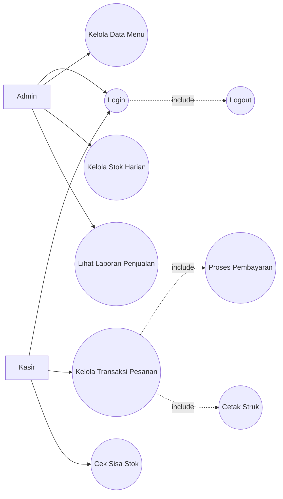
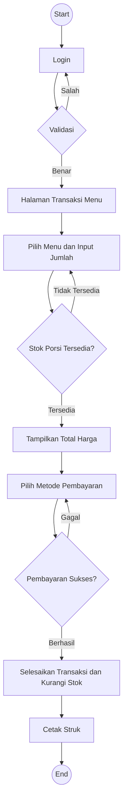
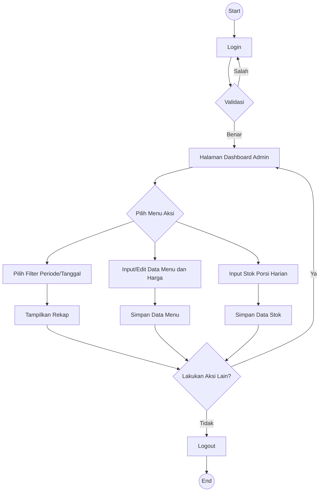

# POS Nasi Lawar Ulucatu

## Kontribusi Anggota Kelompok

| No  | Nama                       | NIM      |
| --- | -------------------------- | -------- |
| 1   | Kadek Wahyu Santika Putra  | 42430012 |
| 2   | I Nyoman Theo Ardiles Rada | 42430018 |

Link video penjelasan kelompok:

| No  | Nama           | Link Video     |
| --- | -------------- | -------------- |
| 1   | Santika & Rada | Isi link video |

## Abstrak

POS Nasi Lawar Ulucatu adalah aplikasi Point of Sale berbasis web untuk membantu proses operasional kasir, pengelolaan produk, pengelolaan kategori, pencatatan transaksi, pembayaran, pencetakan struk thermal, kitchen ticket, dan laporan penjualan. Sistem ini dibangun sebagai Minimum Viable Product (MVP) untuk proyek UAS Rekayasa Perangkat Lunak Tahun Akademik 2025/2026.

Dokumen README ini disusun mengikuti gaya dokumentasi IEEE/SRS secara ringkas agar dapat menjelaskan kebutuhan sistem, metode Waterfall, arsitektur, fitur, cara instalasi, GitFlow, design pattern, dan kontribusi anggota kelompok.

Kata kunci: POS, Laravel, Livewire, Thermal Printer, Dashboard, Rekayasa Perangkat Lunak.

---

## 1. Pendahuluan

### 1.1 Tujuan Dokumen

Dokumen ini bertujuan untuk menjelaskan spesifikasi, arsitektur, cara menjalankan, dan status implementasi aplikasi POS Nasi Lawar Ulucatu sebagai deliverable UAS Rekayasa Perangkat Lunak.

### 1.2 Ruang Lingkup Sistem

Sistem digunakan oleh admin dan kasir untuk menjalankan proses penjualan harian di Nasi Lawar Ulucatu. Ruang lingkup MVP meliputi login, manajemen kategori, manajemen produk, transaksi kasir, pembayaran cash/transfer/QRIS, stok produk, cetak struk, kitchen ticket, dashboard, riwayat transaksi, dan export laporan PDF.

### 1.3 Target Pengguna

| Aktor         | Deskripsi                                                                                                                       |
| ------------- | ------------------------------------------------------------------------------------------------------------------------------- |
| Admin & Owner | Melihat rekap penjualan laporan PDF melalui akun admin dan mengelola kategori, produk, stok, transaksi, dashboard, dan laporan. |
| Kasir         | Melakukan transaksi penjualan, memilih metode pembayaran, dan mencetak struk.                                                   |

### 1.4 Metode Pengembangan

Pengembangan sistem menggunakan metode Waterfall. Tahapan yang digunakan adalah analisis kebutuhan, perancangan sistem, implementasi, pengujian, dan dokumentasi. Kebutuhan fungsional dan non-fungsional pada dokumen ini menjadi acuan utama implementasi MVP.

---

## 2. Deskripsi Umum

### 2.1 Perspektif Produk

POS Nasi Lawar Ulucatu adalah aplikasi web monolitik berbasis Laravel. Frontend dibangun menggunakan Blade, Livewire, Tailwind CSS, dan Vite. Backend menggunakan Laravel, Eloquent ORM, MySQL, dan service class untuk logic pembayaran serta printer thermal.

### 2.2 Fungsi Produk

| Kode | Fungsi                                    | Status  |
| ---- | ----------------------------------------- | ------- |
| F-01 | Login admin dan kasir                     | Selesai |
| F-02 | Manajemen kategori                        | Selesai |
| F-03 | Manajemen produk dan stok                 | Selesai |
| F-04 | Reset stok produk                         | Selesai |
| F-05 | Transaksi POS kasir                       | Selesai |
| F-06 | Input nama customer                       | Selesai |
| F-07 | Pembayaran cash, transfer, dan QRIS       | Selesai |
| F-08 | Konfirmasi/cancel pembayaran QRIS pending | Selesai |
| F-09 | Cetak struk pembayaran                    | Selesai |
| F-10 | Cetak kitchen ticket                      | Selesai |
| F-11 | Riwayat dan filter transaksi              | Selesai |
| F-12 | Dashboard laporan harian dan bulanan      | Selesai |
| F-13 | Export PDF laporan dashboard              | Selesai |

### 2.3 Batasan Sistem

| Kode | Batasan                                                                |
| ---- | ---------------------------------------------------------------------- |
| B-01 | Sistem berjalan sebagai aplikasi web Laravel.                          |
| B-02 | Printer thermal dikontrol dari server/laptop yang menjalankan Laravel. |
| B-03 | Akses iPad/tablet dapat dilakukan melalui jaringan lokal yang sama.    |
| B-04 | QRIS masih menggunakan flow konfirmasi manual kasir.                   |
| B-05 | Laporan PDF dibuat dari data transaksi yang tersimpan di database.     |

---

## 3. Kebutuhan Spesifik

### 3.1 Kebutuhan Fungsional

#### 3.1.1 Autentikasi dan Hak Akses

| ID   | Kebutuhan                                                                                           | Implementasi                                                                         |
| ---- | --------------------------------------------------------------------------------------------------- | ------------------------------------------------------------------------------------ |
| FR-1 | Sistem harus menyediakan halaman Login menggunakan username dan password.                           | `app/Livewire/Auth/Login.php`                                                        |
| FR-2 | Sistem harus dapat membedakan hak akses masuk antara peran Admin (Owner) dan peran Kasir (Pegawai). | `app/Http/Middleware/AdminMiddleware.php`, `app/Http/Middleware/KasirMiddleware.php` |
| FR-3 | Sistem harus memiliki fitur Logout untuk mengakhiri sesi pengguna yang sedang aktif.                | `routes/web.php`                                                                     |

#### 3.1.2 Manajemen Master Data Khusus Admin

| ID   | Kebutuhan                                                                                                               | Implementasi                                                                  |
| ---- | ----------------------------------------------------------------------------------------------------------------------- | ----------------------------------------------------------------------------- |
| FR-4 | Sistem memungkinkan Admin untuk menambah, mengubah harga, dan menghapus data menu makanan, minuman, maupun paket kombo. | `app/Livewire/Admin/ProductIndex.php`, `app/Livewire/Admin/CategoryIndex.php` |
| FR-5 | Sistem harus menyediakan formulir bagi Admin untuk menginput Stok Porsi Harian pada awal hari operasional.              | `app/Livewire/Admin/ProductIndex.php`                                         |

#### 3.1.3 Proses Transaksi Point of Sales Khusus Kasir

| ID    | Kebutuhan                                                                                                                                                           | Implementasi                                                                      |
| ----- | ------------------------------------------------------------------------------------------------------------------------------------------------------------------- | --------------------------------------------------------------------------------- |
| FR-6  | Sistem harus menyediakan antarmuka bagi Kasir untuk menginput pesanan baru, memilih jenis layanan Dine-in atau Take-away, dan memasukkan nomor meja atau antrean.   | `app/Livewire/Kasir/PosIndex.php`, `resources/views/livewire/kasir/pos.blade.php` |
| FR-7  | Sistem harus dapat menghitung subtotal dan total harga pesanan secara otomatis untuk mengurangi risiko human error.                                                 | `app/Livewire/Kasir/PosIndex.php`                                                 |
| FR-8  | Sistem wajib memvalidasi ketersediaan stok porsi secara otomatis. Jika stok menu yang dipilih habis, sistem menampilkan peringatan dan menolak input menu tersebut. | `app/Livewire/Kasir/PosIndex.php`                                                 |
| FR-9  | Sistem harus mendukung penyelesaian transaksi dengan berbagai metode pembayaran, yaitu Tunai, QRIS, dan Transfer Bank.                                              | `app/Livewire/Kasir/PosIndex.php`, `app/Services/TransactionPaymentService.php`   |
| FR-10 | Setelah pembayaran berhasil divalidasi, sistem wajib mengurangi jumlah stok porsi harian secara otomatis secara real-time.                                          | `app/Livewire/Kasir/PosIndex.php`, `app/Services/TransactionPaymentService.php`   |
| FR-11 | Sistem harus dapat mencetak struk transaksi, yaitu satu salinan untuk pelanggan sebagai bukti bayar dan satu salinan untuk dapur sebagai tiket pesanan.             | `app/Services/ThermalPrinterService.php`                                          |

#### 3.1.4 Dasbor Laporan dan Analitik Khusus Admin

| ID    | Kebutuhan                                                                                                                      | Implementasi                                                                                   |
| ----- | ------------------------------------------------------------------------------------------------------------------------------ | ---------------------------------------------------------------------------------------------- |
| FR-12 | Sistem harus menyediakan dasbor rekapitulasi total pendapatan atau omzet harian.                                               | `app/Livewire/Admin/Dashboard.php`                                                             |
| FR-13 | Sistem harus dapat menampilkan laporan sisa porsi harian untuk memantau pergerakan stok secara langsung.                       | `app/Livewire/Admin/Dashboard.php`                                                             |
| FR-14 | Sistem harus menyediakan laporan daftar menu terlaris atau Pareto berdasarkan data transaksi yang sudah berhasil diselesaikan. | `app/Livewire/Admin/Dashboard.php`, `app/Http/Controllers/Admin/DashboardReportController.php` |

### 3.2 Kebutuhan Non-Fungsional

#### 3.2.1 Performa

| ID    | Kebutuhan                                                                                                                                                                 | Implementasi                                                                                                |
| ----- | ------------------------------------------------------------------------------------------------------------------------------------------------------------------------- | ----------------------------------------------------------------------------------------------------------- |
| NFR-1 | Sistem harus memiliki waktu respons kurang dari 2 detik saat Kasir memasukkan pesanan dan menekan tombol Proses Pembayaran untuk mencegah antrean panjang saat peak hour. | Livewire component, query langsung pada transaksi, validasi stok dalam transaksi database.                  |
| NFR-2 | Aplikasi harus dirancang ringan dalam pertukaran data ke database/server karena koneksi utama dapat mengandalkan data seluler akibat WiFi lokasi yang sering terputus.    | Data produk dimuat sesuai filter, transaksi disimpan dalam satu proses, aset frontend dibuild melalui Vite. |

#### 3.2.2 Keamanan

| ID    | Kebutuhan                                                                                                                                                                                              | Implementasi                                                                                                          |
| ----- | ------------------------------------------------------------------------------------------------------------------------------------------------------------------------------------------------------ | --------------------------------------------------------------------------------------------------------------------- |
| NFR-3 | Sistem wajib menerapkan Role-Based Access Control (RBAC) agar Kasir tidak dapat melihat, mengubah, atau menghapus laporan omzet harian maupun data master menu yang hanya boleh diakses Admin (Owner). | `app/Http/Middleware/AdminMiddleware.php`, `app/Http/Middleware/KasirMiddleware.php`, route group di `routes/web.php` |
| NFR-4 | Kata sandi atau PIN pengguna harus disimpan di database menggunakan hashing agar tidak dapat dibaca oleh pihak tidak berwenang.                                                                        | `Hash::make()` pada seeder dan mekanisme autentikasi Laravel.                                                         |

#### 3.2.3 Skalabilitas

| ID    | Kebutuhan                                                                                                                                                         | Implementasi                                                                                |
| ----- | ----------------------------------------------------------------------------------------------------------------------------------------------------------------- | ------------------------------------------------------------------------------------------- |
| NFR-5 | Sistem harus dirancang fleksibel agar Admin dapat menambahkan kategori menu baru, varian paket baru, atau menyesuaikan harga tanpa merombak source code aplikasi. | Modul kategori dan produk dinamis melalui database pada `CategoryIndex` dan `ProductIndex`. |

#### 3.2.4 Reliabilitas

| ID    | Kebutuhan                                                                                                                                                                           | Implementasi                                                                                                                  |
| ----- | ----------------------------------------------------------------------------------------------------------------------------------------------------------------------------------- | ----------------------------------------------------------------------------------------------------------------------------- |
| NFR-6 | Sistem diharapkan memiliki tingkat uptime yang tinggi selama jam operasional rumah makan.                                                                                           | Aplikasi dapat dijalankan pada server/laptop lokal selama jam operasional; production dapat memakai web server permanen.      |
| NFR-7 | Sistem harus memiliki error handling yang baik. Jika terjadi putus koneksi sesaat saat Kasir memproses transaksi, sistem tidak boleh menyimpan data ganda atau menghilangkan struk. | `DB::beginTransaction()`, `DB::commit()`, `DB::rollBack()`, `lockForUpdate()`, serta proses cetak setelah transaksi berhasil. |

#### 3.2.5 Kemudahan Penggunaan

| ID    | Kebutuhan                                                                                                                                                      | Implementasi                                                                          |
| ----- | -------------------------------------------------------------------------------------------------------------------------------------------------------------- | ------------------------------------------------------------------------------------- |
| NFR-8 | Antarmuka pengguna harus minimalis dan intuitif. Tombol menu dan metode pembayaran harus proporsional agar cepat ditekan dan touch-friendly pada layar tablet. | UI POS berbasis card, tombol metode pembayaran besar, layout responsive Tailwind CSS. |

#### 3.2.6 Kompatibilitas

| ID     | Kebutuhan                                                                                                                                             | Implementasi                                                                                                                                      |
| ------ | ----------------------------------------------------------------------------------------------------------------------------------------------------- | ------------------------------------------------------------------------------------------------------------------------------------------------- |
| NFR-12 | Aplikasi harus kompatibel dan berjalan lancar pada Android, khususnya orientasi layar tablet maupun smartphone standar yang tersedia di lokasi usaha. | Aplikasi berbasis web responsive sehingga dapat diakses melalui browser Android, tablet, smartphone, laptop, dan iPad selama terhubung ke server. |

---

## 4. Tech Stack

| Kategori        | Teknologi                         |
| --------------- | --------------------------------- |
| Backend         | PHP 8.2+, Laravel 12              |
| Frontend        | Blade, Livewire 3, Tailwind CSS 4 |
| Build Tool      | Vite 7                            |
| Database        | MySQL                             |
| PDF             | `barryvdh/laravel-dompdf`         |
| Thermal Printer | `mike42/escpos-php`               |
| Testing         | Pest, Laravel Test                |
| Formatter       | Laravel Pint                      |
| Package Manager | Composer, npm                     |

---

## 5. Arsitektur Sistem

### 5.1 Pola Arsitektur

Project ini menggunakan pendekatan Layered Architecture yang disesuaikan dengan struktur Laravel dan Livewire.

| Layer                      | Tanggung Jawab                                                | Lokasi File                                         |
| -------------------------- | ------------------------------------------------------------- | --------------------------------------------------- |
| Presentation Layer         | UI, routing, komponen halaman, validasi form, interaksi user. | `routes/web.php`, `app/Livewire`, `resources/views` |
| Application/Business Layer | Orkestrasi logic pembayaran, stok, printer, dan laporan.      | `app/Services`, `app/Http/Controllers`              |
| Data Access Layer          | Model dan akses database menggunakan Eloquent ORM.            | `app/Models`, `database/migrations`                 |
| Infrastructure Layer       | Integrasi printer thermal, storage, PDF, konfigurasi.         | `config`, `app/Services/ThermalPrinterService.php`  |

### 5.2 Diagram Layer

```txt
Browser / iPad / Laptop
        |
        v
Laravel Routes
        |
        v
Livewire Components / Controllers
        |
        v
Services
        |
        v
Eloquent Models / Database
        |
        v
External Services: Thermal Printer, PDF Generator, Storage
```

### 5.3 Struktur Folder Utama

```txt
app/
├── Console/Commands/          # Command test printer
├── Http/Controllers/          # Controller export PDF
├── Http/Middleware/           # Middleware role admin dan kasir
├── Livewire/                  # Presentation logic halaman
├── Models/                    # Eloquent models
├── Providers/                 # Service provider Laravel
└── Services/                  # Business/application services

config/                        # Konfigurasi aplikasi dan printer
database/
├── migrations/                # Schema database
├── seeders/                   # Seeder akun awal development
└── factories/                 # Factory testing/development

resources/
├── views/                     # Blade dan Livewire views
├── css/                       # CSS entrypoint
└── js/                        # JS entrypoint

routes/                        # Route web dan console
tests/                         # Unit dan feature tests
```

### 5.4 Diagram Use Case



### 5.5 Activity Diagram Kasir



### 5.6 Activity Diagram Admin



---

## 6. Design Patterns yang Digunakan

| No  | Design Pattern | Lokasi File                                                | Tujuan Penggunaan                                                                                                                               |
| --- | -------------- | ---------------------------------------------------------- | ----------------------------------------------------------------------------------------------------------------------------------------------- |
| 1   | Adapter        | `app/Services/ThermalPrinterService.php`                   | Membungkus library `mike42/escpos-php` agar fitur POS cukup memanggil service aplikasi tanpa bergantung langsung pada detail connector printer. |
| 2   | Facade         | `app/Http/Controllers/Admin/DashboardReportController.php` | Menggunakan facade `Pdf` untuk menyederhanakan akses ke generator PDF Laravel DomPDF.                                                           |
| 3   | Service Layer  | `app/Services/TransactionPaymentService.php`               | Memisahkan logic konfirmasi pembayaran QRIS, validasi status, dan pengurangan stok dari komponen UI.                                            |

Catatan: Adapter dan Facade termasuk pattern yang relevan untuk integrasi library eksternal. Service Layer digunakan sebagai pattern arsitektural untuk menjaga logic bisnis tidak menumpuk di komponen Livewire.

---

## 7. Database

### 7.1 Entitas Utama

| Entitas               | Deskripsi                                                         |
| --------------------- | ----------------------------------------------------------------- |
| `users`               | Data akun admin dan kasir.                                        |
| `categories`          | Data kategori produk.                                             |
| `products`            | Data produk, harga, stok, status aktif, dan gambar.               |
| `transactions`        | Data header transaksi, invoice, customer, pembayaran, dan status. |
| `transaction_details` | Detail produk yang dibeli pada transaksi.                         |

### 7.2 Relasi Utama

| Relasi                          | Keterangan                                           |
| ------------------------------- | ---------------------------------------------------- |
| User - Transaction              | Satu user/kasir dapat menangani banyak transaksi.    |
| Category - Product              | Satu kategori memiliki banyak produk.                |
| Transaction - TransactionDetail | Satu transaksi memiliki banyak detail transaksi.     |
| Product - TransactionDetail     | Satu produk dapat muncul di banyak detail transaksi. |

---

## 8. Cara Menjalankan Project Secara Lokal

### 8.1 Prasyarat

| Tools    | Versi Minimum   |
| -------- | --------------- |
| PHP      | 8.2             |
| Composer | 2.x             |
| Node.js  | 20.x disarankan |
| npm      | 10.x disarankan |
| MySQL    | 8.x disarankan  |

### 8.2 Clone Repository

```bash
git clone https://github.com/wsantika/pos-nasiLawarUlucatu.git
cd pos-nasiLawarUlucatu
```

### 8.3 Install Dependency

```bash
composer install
npm install
```

### 8.4 Setup Environment

```bash
cp .env.example .env
php artisan key:generate
```

Sesuaikan konfigurasi database di `.env`.

```env
DB_CONNECTION=mysql
DB_HOST=127.0.0.1
DB_PORT=3306
DB_DATABASE=pos_nasilawarulucatu
DB_USERNAME=root
DB_PASSWORD=
```

Konfigurasi printer thermal tersedia di `.env`.

```env
THERMAL_PRINTER_ENABLED=true
THERMAL_PRINTER_NAME=POS-58
THERMAL_PRINTER_LINE_WIDTH=32
THERMAL_PRINTER_CUT=false
```

### 8.5 Migrasi Database

```bash
php artisan migrate
```

Seeder dapat digunakan untuk development.

```bash
php artisan db:seed
```

Catatan: Jangan gunakan credential default seeder untuk production tanpa mengganti password.

### 8.6 Jalankan Aplikasi Development

```bash
composer run dev
```

Atau jalankan proses secara manual.

```bash
php artisan serve
npm run dev
```

### 8.7 Jalankan di iPad atau Device Satu WiFi

Build asset terlebih dahulu.

```bash
npm run build
php artisan serve --host=0.0.0.0 --port=8000
```

Buka dari iPad menggunakan IP laptop/server.

```txt
http://192.168.x.x:8000
```

### 8.8 Test Printer

```bash
php artisan printer:test
```

---

## 9. Testing, Linter, dan Formatting

### 9.1 Menjalankan Test

```bash
php artisan test
```

Atau melalui script Composer.

```bash
composer test
```

### 9.2 Formatting PHP

Project menggunakan Laravel Pint sebagai formatter PHP.

```bash
./vendor/bin/pint
```

### 9.3 Build Asset

```bash
npm run build
```

### 9.4 Bukti Verifikasi Terakhir

```txt
php artisan test
Tests: 2 passed
```

---

## 10. GitFlow Workflow

Project ini menggunakan alur GitFlow.

| Branch               | Fungsi                         |
| -------------------- | ------------------------------ |
| `main`               | Branch stabil/production.      |
| `dev`                | Branch integrasi pengembangan. |
| `feature/nama-fitur` | Branch pengerjaan fitur.       |
| `fix/nama-bug`       | Branch perbaikan bug.          |

Aturan kontribusi:

- Tidak melakukan commit langsung ke `main`.
- Fitur dan bugfix dikerjakan pada branch terpisah.
- Merge perubahan dilakukan melalui Pull Request.
- Commit mengikuti conventional commits.

Contoh commit yang digunakan:

```txt
feat(payment): add customer name column
feat(printer): prompt receipt printing after payment
fix(payment): set shortcut amount directly
feat(report): add PDF export functionality for daily and monthly reports
```

---

## 11. Dokumentasi Tambahan

Saat ini folder `docs/` belum tersedia di repository. Jika diagram UTS diperbarui, simpan dokumentasi tambahan di folder `docs/`.

Dokumentasi yang disarankan:

- Use Case Diagram
- Activity Diagram
- Sequence Diagram
- Class Diagram
- ERD
- Dokumentasi perubahan dari rancangan UTS

---

## 12. Status MVP

| Kategori        | Status       | Keterangan                                                  |
| --------------- | ------------ | ----------------------------------------------------------- |
| Autentikasi     | Selesai      | Login dan role admin/kasir tersedia.                        |
| Admin Panel     | Selesai      | Dashboard, kategori, produk, transaksi.                     |
| POS Kasir       | Selesai      | Keranjang, pembayaran, customer, struk.                     |
| QRIS Manual     | Selesai      | Pending, confirm, cancel.                                   |
| Printer Thermal | Selesai      | Customer receipt dan kitchen ticket.                        |
| Export PDF      | Selesai      | Laporan harian dan bulanan.                                 |
| Testing         | Minimal      | Test bawaan Laravel berjalan.                               |
| Dokumentasi     | Selesai awal | README format IEEE tersedia, data anggota perlu dilengkapi. |

---

## 13. Checklist Sebelum Pengumpulan

### 14.1 Produk Kelompok

- [x] Aplikasi dapat dijalankan secara lokal.
- [x] Fitur MVP utama tersedia.
- [x] Validasi input tersedia pada fitur penting.
- [x] Error handling dasar tersedia.
- [x] Struktur folder mengikuti Laravel dan layered architecture.
- [x] Minimal 2 pattern didokumentasikan.
- [x] README utama tersedia.
- [x] Data kontribusi anggota sudah lengkap.
- [ ] Link video individu sudah lengkap.
- [x] Dokumentasi diagram tambahan tersedia jika diwajibkan.

### 14.2 Git dan Kolaborasi

- [x] Commit menggunakan conventional commits.
- [x] Branch `main` digunakan untuk versi stabil.
- [x] Branch `dev` digunakan untuk integrasi pengembangan.
- [x] Pull Request digunakan pada merge fitur sebelumnya.

---

## 14. Lisensi

Project ini dibuat untuk kebutuhan akademik UAS Rekayasa Perangkat Lunak 2025/2026. Dependency Laravel mengikuti lisensi masing-masing package.
