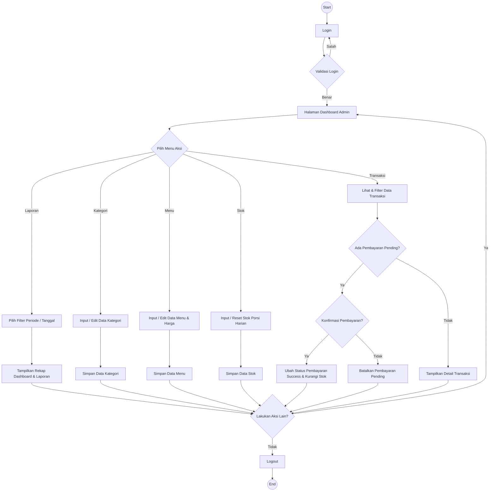

# Activity Diagram Admin

```mermaid
flowchart TD
    start((Start)) --> login[Login]
    login --> validasi{Validasi Login}

    validasi -- Salah --> login
    validasi -- Benar --> dashboard[Halaman Dashboard Admin]

    dashboard --> aksi{Pilih Menu Aksi}

    aksi -- Laporan --> filter[Pilih Filter Periode / Tanggal]
    filter --> rekap[Tampilkan Rekap Dashboard & Laporan]
    rekap --> lanjut{Lakukan Aksi Lain?}

    aksi -- Kategori --> kategori[Input / Edit Data Kategori]
    kategori --> simpanKategori[Simpan Data Kategori]
    simpanKategori --> lanjut

    aksi -- Menu --> menu[Input / Edit Data Menu & Harga]
    menu --> simpanMenu[Simpan Data Menu]
    simpanMenu --> lanjut

    aksi -- Stok --> stok[Input / Reset Stok Porsi Harian]
    stok --> simpanStok[Simpan Data Stok]
    simpanStok --> lanjut

    aksi -- Transaksi --> transaksi[Lihat & Filter Data Transaksi]
    transaksi --> pending{Ada Pembayaran Pending?}
    pending -- Ya --> konfirmasi{Konfirmasi Pembayaran?}
    konfirmasi -- Ya --> sukses[Ubah Status Pembayaran Success & Kurangi Stok]
    konfirmasi -- Tidak --> batal[Batalkan Pembayaran Pending]
    sukses --> lanjut
    batal --> lanjut
    pending -- Tidak --> detail[Tampilkan Detail Transaksi]
    detail --> lanjut

    lanjut -- Ya --> dashboard
    lanjut -- Tidak --> logout[Logout]
    logout --> finish((End))
```
