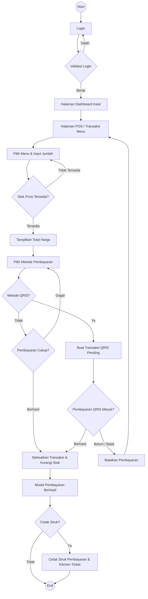

# Activity Diagram Kasir

```mermaid
flowchart TD
    start((Start)) --> login[Login]
    login --> validasi{Validasi Login}

    validasi -- Salah --> login
    validasi -- Benar --> dashboard[Halaman Dashboard Kasir]
    dashboard --> pos[Halaman POS / Transaksi Menu]

    pos --> pilih[Pilih Menu & Input Jumlah]
    pilih --> stok{Stok Porsi Tersedia?}

    stok -- Tidak Tersedia --> pilih
    stok -- Tersedia --> total[Tampilkan Total Harga]
    total --> metode[Pilih Metode Pembayaran]

    metode --> jenis{Metode QRIS?}

    jenis -- Tidak --> bayar{Pembayaran Cukup?}
    bayar -- Gagal --> metode
    bayar -- Berhasil --> selesai[Selesaikan Transaksi & Kurangi Stok]

    jenis -- Ya --> qris[Buat Transaksi QRIS Pending]
    qris --> konfirmasi{Pembayaran QRIS Masuk?}
    konfirmasi -- Belum / Batal --> gagal[Batalkan Pembayaran]
    gagal --> pos
    konfirmasi -- Berhasil --> selesai

    selesai --> sukses[Modal Pembayaran Berhasil]
    sukses --> cetak{Cetak Struk?}
    cetak -- Ya --> struk[Cetak Struk Pembayaran & Kitchen Ticket]
    cetak -- Tidak --> finish((End))
    struk --> finish
```
