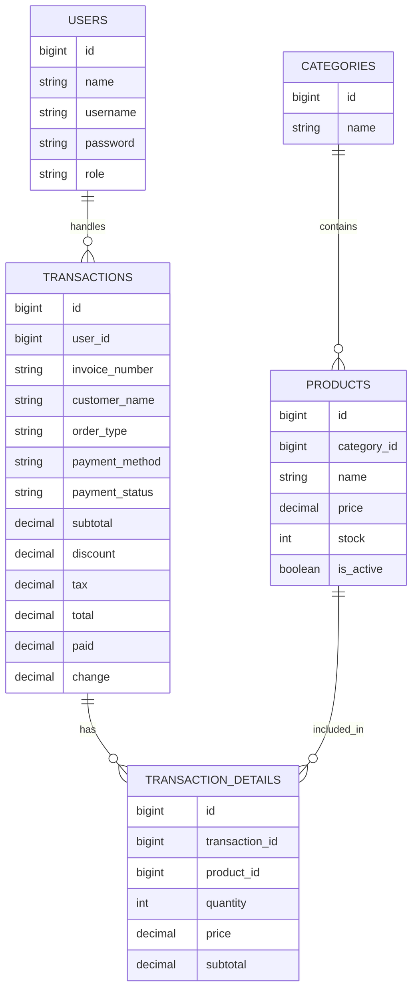

# ERD

## Entitas Utama

| Entitas               | Deskripsi                                                                       |
| --------------------- | ------------------------------------------------------------------------------- |
| `users`               | Menyimpan data akun admin dan kasir                                             |
| `categories`          | Menyimpan kategori produk/menu                                                  |
| `products`            | Menyimpan data produk, harga, stok, status aktif, dan gambar                    |
| `transactions`        | Menyimpan header transaksi, invoice, customer, pembayaran, dan status transaksi |
| `transaction_details` | Menyimpan detail produk yang dibeli dalam transaksi                             |

## Relasi Utama

| Relasi                          | Keterangan                                          |
| ------------------------------- | --------------------------------------------------- |
| User - Transaction              | Satu user/kasir dapat menangani banyak transaksi    |
| Category - Product              | Satu kategori memiliki banyak produk                |
| Transaction - TransactionDetail | Satu transaksi memiliki banyak detail transaksi     |
| Product - TransactionDetail     | Satu produk dapat muncul di banyak detail transaksi |

## ERD Sederhana

