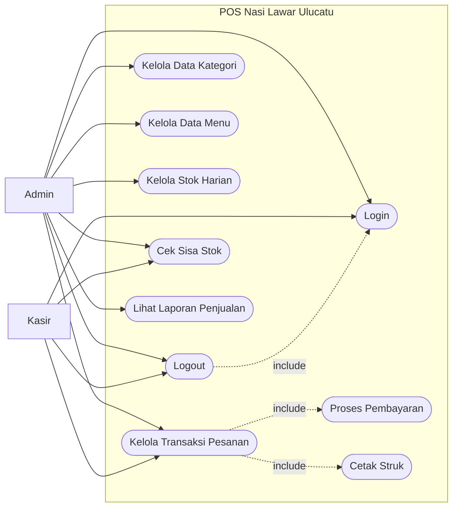

# Use Case Diagram

```mermaid
flowchart LR
    admin[Admin]
    kasir[Kasir]

    subgraph sistem[POS Nasi Lawar Ulucatu]
        login([Login])
        logout([Logout])
        kelolaKategori([Kelola Data Kategori])
        kelolaMenu([Kelola Data Menu])
        kelolaStok([Kelola Stok Harian])
        kelolaTransaksi([Kelola Transaksi Pesanan])
        prosesPembayaran([Proses Pembayaran])
        cetakStruk([Cetak Struk])
        cekStok([Cek Sisa Stok])
        laporan([Lihat Laporan Penjualan])
    end

    admin --> login
    admin --> kelolaKategori
    admin --> kelolaMenu
    admin --> kelolaStok
    admin --> kelolaTransaksi
    admin --> cekStok
    admin --> laporan
    admin --> logout

    kasir --> login
    kasir --> kelolaTransaksi
    kasir --> cekStok
    kasir --> logout

    kelolaTransaksi -. include .-> prosesPembayaran
    kelolaTransaksi -. include .-> cetakStruk
    logout -. include .-> login
```
